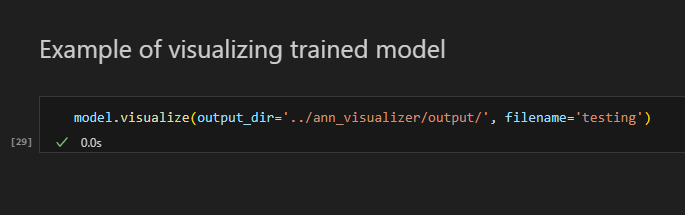
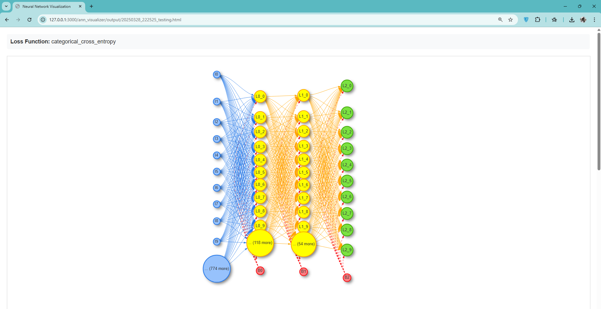
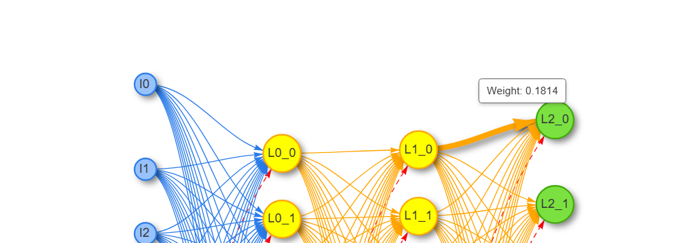

# Project Name
> Tugas Besar 1 IF3170 Pembelajaran Mesin Feed Forward Neural Network

## Table of Contents
- [Project Name](#project-name)
  - [Table of Contents](#table-of-contents)
  - [General Information](#general-information)
  - [Technologies Used](#technologies-used)
  - [Features](#features)
  - [Setup](#setup)
  - [Usage](#usage)
  - [Project Status](#project-status)
  - [Room for Improvement](#room-for-improvement)
  - [Acknowledgements](#acknowledgements)

## General Information
- Project ini diadakan dalam pemenuhan komponen tugas besar IF3170 Pembelajaran Mesin
- Tujuan dari project ini adalah agar peserta kuliah mendapatkan wawasan tentang bagaimana cara mengimplementasikan Feedforward Neural Network (FFNN).

## Technologies Used
- Python - version 3.13.1
- HTML, CSS, JS for visualization (needs to be online so that cdn vis.js works)

## Features
- Custom ANN model with no high level libraries
- Visualize ANN using vis.js
- ANN analysis

## Setup
1.  Make sure to have python intalled, to check whether or not you have it installed, you can check by typing 

    ```
    python --version
    Python 3.13.1
    ```

2. Install dependencies using pip install and requirements.txt
    ```
    pip install -r requirements.txt
    ```

## Usage
- Our group has completed the analysis in main.ipynb, which can be found at src/main.ipynb
- We have also provided src/example.ipynb, which users can run to try out our visualization feature. Step by step :

1. Run example.ipynb all the way to the bottom:

    

2. After the last cell has been executed, an HTML file will be generated in the ann_visualizer/output folder.
3. Use Live Preview to view the HTML file and the graph.

    

4. To view the weight of the edges, users can click said edges, the weight label will then show itself

    

## Project Status
Project is: Done

## Room for Improvement
- Code optimization, training ANN takes too much RAM
- Code optimization, training ANN takes too much time, reduce time by make it parallel


## Acknowledgements
Nama : Maximilian Sulistiyo</br>
NIM : 13522061 </br>
Profile Github : [riyorax](https://github.com/riyorax)</br>

Nama : Marvel Pangondian</br>
NIM : 13522075 </br>
Profile Github : [MarvelPangondian](https://github.com/MarvelPangondian)</br>

Nama : Abdullah Mubarak</br>
NIM : 13522101 </br>
Profile Github : [b33rk](https://github.com/b33rk)</br>
</br>